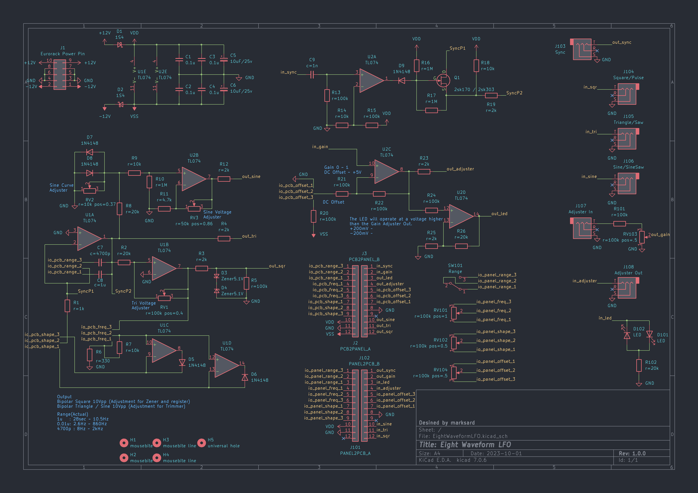

# Eight Waveform LFO

Eight Waveform LFO for Eurorack

## Specification

### Power

|Use Voltage|Current consumption|
|:--|:--|
|+12V|18mA|
|-12V|18mA|

### Input

|Name|Description|
|:--|:--|
|Sync|-|
|Adjust In|BIPOLER to UNIPOLER and ATTENUATOR|

### Output

|Name|Description|
|:--|:--|
|SQU/PULSE|SQUARE or PULSE  BIPOLER 10.5Vpp|
|TRI/SAW|TRIANGLE or DOWN/UP SAW  BIPOLER 10Vpp|
|SINE/S.SAW| SINE AND Cos/Tan Curve BIPOLER 10Vpp|
|Adjust Out|-|

### Controller

|Name|Description|
|:--|:--|
|Freq Pot|Frequency|
|Shape Pot|Wave shape|
|Range|LOW:28Sec ~ 10Hz HIGH:8Hz ~ 2kHz|
|Gain|Attenuator for Adjust In|
|Offset|DC Offset for Adjust In|

## Image

## Schematic

## Waveform

Square
  

Triangle
  

Sine
  

Pulse
  
  

Saw
  
  

Sine
  
  

Sync
  
